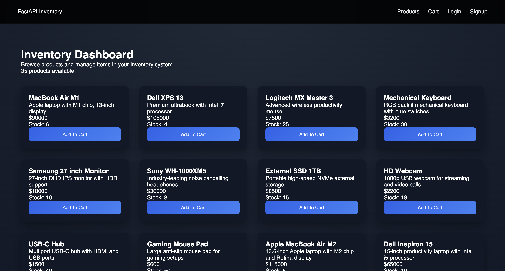
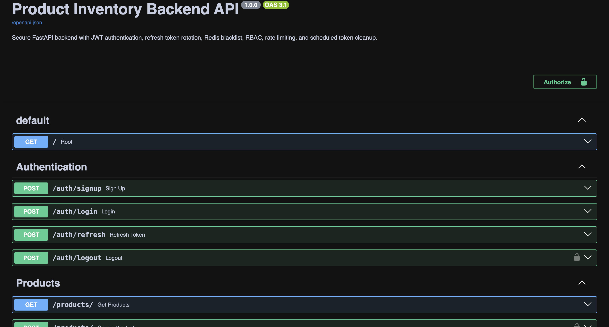
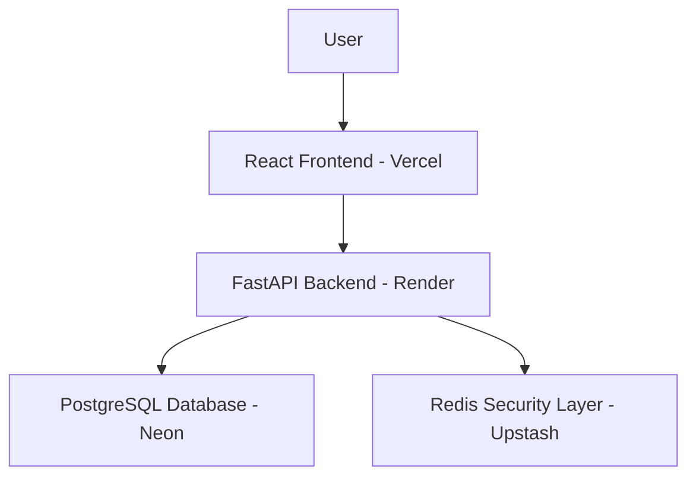
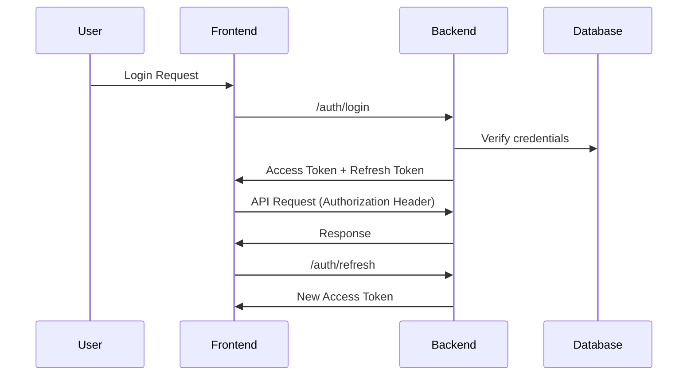

---

# FastAPI Secure Product Inventory Backend 🔐📦


A **production-oriented backend system** built with **FastAPI**, demonstrating secure authentication, Redis-based security controls, rate limiting, and scalable API architecture.

This project focuses primarily on **backend engineering**, while the React frontend acts as a **client interface used to interact with backend APIs**.

The goal of this project is to demonstrate skills relevant for **Backend / Python Developer roles**, including authentication systems, Redis-based security mechanisms, modular backend architecture, and API development.

---

# 🌐 Live Demo

### Full Application (Frontend + Backend)

[https://fastapi-jwt-redis-backend.vercel.app]

### Backend API

[https://fastapi-jwt-redis-backend.onrender.com]

### API Documentation

[https://fastapi-jwt-redis-backend.onrender.com/docs]

---

# 📸 Application Screenshots

## Inventory Dashboard



Users can browse products and add items to their cart.

---


## API Documentation



Interactive API documentation generated by FastAPI.

---

# 🏗 System Architecture



---

# 🚀 Backend Capabilities Demonstrated

This project demonstrates real-world backend engineering patterns:

• Secure authentication system
• Redis security layers
• Rate limiting implementation
• Structured logging
• Modular API architecture
• Token lifecycle management
• Background task scheduling
• Role-based access control

---

# 🔑 Authentication & Security

The application uses a **JWT-based authentication system**.

### Security features

• Access Token authentication
• Refresh Token rotation
• Refresh token reuse detection
• HTTPOnly refresh token cookies
• Secure logout using Redis blacklist
• Secure logout using refresh token revokation
• Password hashing using bcrypt

---

# 🔄 Authentication Flow



---

# 🛡 Authorization (RBAC)

Role-Based Access Control is implemented.

Roles:

```
Admin
User
```

Admin permissions:

• Create products
• Update products
• Delete products

User permissions:

• View products
• Add products to cart
• Manage cart items

Authorization is enforced through **FastAPI dependencies**.

---

# ⚡ Redis Security Layer

Redis is used to implement backend security features.

Redis enables:

• Login rate limiting
• Refresh token rate limiting
• Token blacklist for logout
• Fast token validation
• Automatic expiration using TTL

Example Redis keys:

```
login:ip:<ip>
login:email:<email>
refresh:ip:<ip>
refresh:user_id:<id>
blacklist:<access_token>
```

---

# 🚫 Rate Limiting

Login and Refresh tokens attempts are limited to prevent brute-force attacks per Email or Username and IP address.

Example configuration:

```
Maximum attempts: 5
Window: 60 seconds
```

Exceeded attempts return:

```
HTTP 429 Too Many Requests
```

Redis automatically resets counters using TTL.

---

# 📊 Structured Logging

Security events are logged using structured logs.

Example logs:

```
event=login_attempt ip=103.x.x.x email=user@email.com
event=login_rate_limit_exceeded ip=103.x.x.x
event=login_success user_id=3
```

This demonstrates **observability practices used in production systems**.

---

# 🛒 Cart Management

Each user maintains an isolated cart.

Features:

• Add products to cart
• Update cart quantity
• Remove cart items
• User-specific cart isolation

Example endpoints:

```
POST /cart/add
PATCH /cart/update/{product_id}
DELETE /cart/remove/{product_id}
```

---

# 📦 Product Inventory

Admin-controlled inventory system.

Endpoints:

```
GET /products
POST /products
PATCH /products/{id}
DELETE /products/{id}
```

Users can browse products and add them to their cart.

---

# ⏱ Background Task System

Background tasks are implemented using **APScheduler**.

Tasks include:

```
Cleanup of expired tokens
Maintenance of revoked tokens
```

This demonstrates backend **background job scheduling**.

---

# 🛠 Tech Stack

## Backend

FastAPI
Python
PostgreSQL
SQLAlchemy ORM
Redis
APScheduler
python-jose (JWT)
passlib / bcrypt

---

## Frontend (Client Interface)

React
Vite
Axios

The frontend is intentionally lightweight because the **primary focus of this project is backend architecture**.

---

# ☁ Infrastructure

Database: Neon PostgreSQL
Redis: Upstash
Backend Deployment: Render
Frontend Deployment: Vercel

---

# 📁 Project Structure

```
fastapi-jwt-redis-backend
│
├── app
│   ├── core
│   │   ├── auth.py
│   │   ├── security.py
│   │   ├── redis_client.py
│   │   └── rate_limiter.py
│   │
│   ├── db
│   │   ├── database.py
│   │   └── database_models.py
│   │
│   ├── routers
│   │   ├── auth_router.py
│   │   ├── product_router.py
│   │   └── cart_router.py
│   │
│   ├── services
│   │   ├── cart_service.py
│   │   └── product_service.py
│   │
│   ├── tasks
│   │   └── token_cleanup.py
│   │
│   └── main.py
│
├── frontend
│   ├── src
│   ├── pages
│   ├── components
│   └── api
│
├── screenshots
│
├── requirements.txt
└── README.md
```

---

# ⚙ Local Development Setup

### Clone repository

```
git clone https://github.com/AkashAkuthota/fastapi-jwt-redis-backend.git
cd fastapi-jwt-redis-backend
```

---

### Create virtual environment

```
python -m venv myenv
source myenv/bin/activate
```

---

### Install dependencies

```
pip install -r requirements.txt
```

---

### Environment variables

Create `.env`

```
SECRET_KEY=your_secret_key

DATABASE_URL=your_postgres_connection

REDIS_HOST=your_upstash_host
REDIS_PORT=6379
REDIS_PASSWORD=your_upstash_password

ACCESS_TOKEN_EXPIRE_MINUTES=30
REFRESH_TOKEN_EXPIRE_DAYS=7
```

---

### Run backend

```
uvicorn app.main:app --reload
```

API docs:

```
http://localhost:8000/docs
```

---

### Run frontend

```
cd frontend
npm install
npm run dev
```

---

# 🎯 Project Goal

This project demonstrates backend engineering practices such as:

• Secure authentication systems
• Redis-based security controls
• Rate limiting implementation
• Scalable API design
• Modular backend architecture
• Token lifecycle management
• Background job scheduling
• Observability through structured logging

The project is designed to showcase capabilities relevant for **Backend / Python Developer roles**, while also demonstrating the ability to integrate backend APIs with a frontend client.

---

# 👨‍💻 Author

**Akash Akuthota**

GitHub
[https://github.com/AkashAkuthota]

LinkedIn
[https://www.linkedin.com/in/akashakuthota/]

---

# ⭐ If you found this useful

Consider giving the repository a **star ⭐ on GitHub**.

---
